# Technology Use in Museums in Central Europe

##### Haley Fletcher

##### Faculty Mentor: Dr. Ray Toal

### Background

“ASTC Passport Program.” *Orlando Science Center*, www.osc.org/support/membership/astc/.

##### About the Author

​	I am a Senior Computer Science major attending Loyola Marymount University in Los Angeles, California. My love for museums started as an early child when my mom took me to the Orlando Science Center. There was a fun, tactile exhibit where one could pick "oranges" off of "trees"(Shown above) and ride a stationary bike to transport them. My brother and I spent what felt like hours at that exhibit. This love for museums has only grown as I have gotten older and been able to travel and see more museums with beautiful art collections and intriguing history exhibits. My main goal for this research was to combine my two loves of technology and museums and to explore that space in a new and intriguing way.

​	As a Computer Science major I have encountered many different trends that our culture gets excited about. Buzzwords like virtual reality, machine learning, and augmented reality are much of what I hear day to day. These technologies have been used in many different contexts but the one that interests me most is in education. Between my Sophomore and Junior year, I worked as an instructor for a technology camp. My responsibilities were to create lesson plans, find engaging ways to teach the kids, and help them learn something they could be excited about at the end of the day. The students learned to build their own laptops and I was able to witness, first hand, the benefits of learning through creation. Using technology to educate the students about technology was exciting for me. However, the use of technology as a medium for instruction can be used in a multitude of subjects, not solely to teach about technology. That is what brought me to my research. Exploring the use of technology to teach about topics as diverse as art, history, aerospace, architecture, nature and design through the explorative format of museums.

##### Museums Researched

​	In this research, I wanted to observe teaching methods in a variety of different subjects but all within fairly close geographical range of each other. Due to some of the museums on this list being stand out subjects of interest, as well as having had multiple publications about them, I decided on Central Europe. The museums on this list spanned: The Netherlands, Germany, and Austria and focus on a large variety of different subjects.

[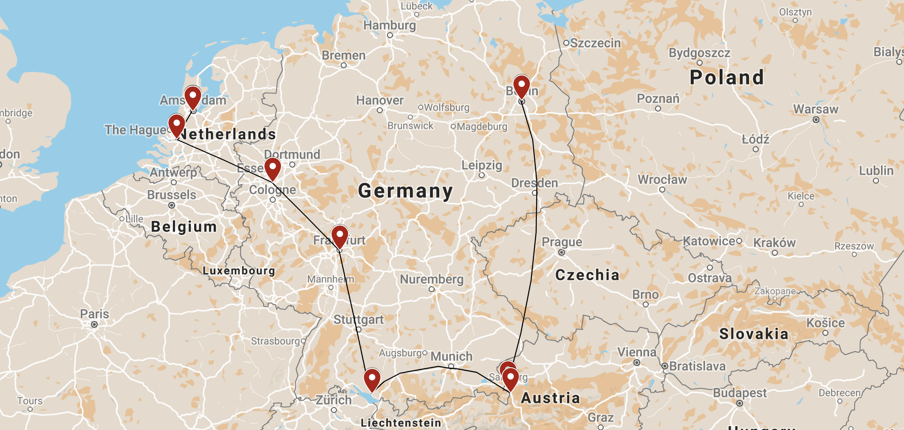](https://drive.google.com/open?id=1oB8V2e3eRN2I7xjKYGf-mQ7WLDft63yV&usp=sharing)

* The Van Gogh Museum, Amsterdam, Netherlands (Art)
* The Rijksmuseum, Amsterdam, Netherlands (Art & History)
* Het Nieuwe Instituut, Rotterdam, Netherlands (Design, Digital Culture, & Architecture)
* Neanderthal Museum, Mettmann, Germany (Archaeology)
* Städel Museum, Frankfurt, Germany (Art)
* Dornier Museum, Friedrichshafen, Germany (Aviation)
* Haus Der Natur, Salzburg, Austria (Nature & Technology)
* Keltenmuseum, Hallein, Austria (History)
* Museum für Naturkunde, Berlin, Germany (Natural History)

##### Education in Museums

​	Museums have often been the places that society goes to for education outside of the normal mediums such as classrooms, books, and the internet. Museums are expected to preserve and restore collections, engage visitors, disseminate research findings and, educate the public (Enasel 477). Museums have observed many changes over the past few years: “Changing demographics...and expectations for high-quality and participatory experiences have meant that museum professionals must better understand their audiences and respond to their changing interests and desires” (Fogarty 128). Museums have responded by changing their exhibits to increasingly incorporate technology.

​	Advanced technology is often used in museums in flashy exhibits that attract patronage from the public. However, technology can also be utilized more effectively in public education. Certain educational theories can be applied to these exhibits to evaluate their educational value. The constructionist theory of education developed by Seymour Papert states that “people build knowledge most effectively when they are actively engaged in constructing things in the world” (MIT News Office). Another revolutionary mind in the field of education and a theory on which we can base this research is Maria Montessori. Her contributions to the field include the theory that children are inherently curious and learning-driven. She also strongly believed in employing physical environments filled with objects available for children to experience and learn from (David L). Her theories of learning differ from Papert’s, but they provide similar executions, in that they both emphasize the physicality of learning and the ability to interact with objects in one’s environment, both of which are central to education in the museum medium. These theories provide the background that contextualizes this research.

##### User Experience

​	Another facet that heavily influences the evaluation of these museums' exhibits is the user's experience with these new technologies. User Experience encompasses a very broad and developing field. The 

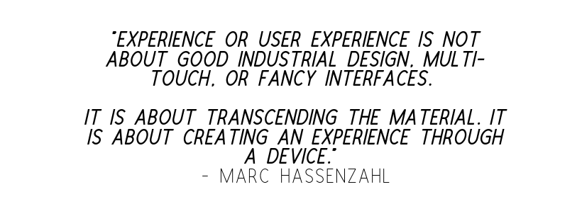

Interaction Design Foundation defines design principles as "widely applicable laws, guidelines, biases and design considerations, all reflecting researchers’ and practitioners’ accumulated knowledge and experience" (“What Are Design Principles?”). In contrast, Marc Hassenzahl, a professor for "User Experience and Ergonomics" at the Folkwang University in Essen, Germany, elaborates that "Experience or User Experience is not about good industrial design, multi-touch, or fancy interfaces. It is about transcending the material. It is about creating an experience through a device" (Hassenzahl). The experience that trancends the technology will be what this research focuses on. In the different museums there were many different technologies used. This allows us to look beyond the technolgies themselves and look at the greater experience that was enhanced by technology.

##### Research Methods

​	In evaluating these exhibits' use of technology the two facets we will be assessing are the educational value as well as the user experience.  The metrics we will be using to evaluate are inspired by Peter Morville's user experience honeycomb. Morville is a pioneer in information architecture and details out the following facets of user experience:

)

 * Useful
* Desirable
* Usable
* Valuable
* Findable
* Accessible
* Credible

   These facets are broad and can encompass a wide range of technologies. Therefore, the exhibits will be evaluated using these criteria. These values question whether the exhibits are genuinely useful, easy to use or usable, desirable or implementing elements of emotional design, findable or easily navigated, accesible by a wide audience, credible, and valuable.

​	The second aspect on which the museums' digital experiences will be evaluated is on their educational value as inspired by constructionist principles. Not only does constructionism very easily translate to the museum space, but research shows that "problem-based, project-based, and ‘maker’ learning demonstrably increase learner engagement and reduce the number of students who leave school" (Charles). The aspects on which we will assess these exhibits are taken from Lorraine Charles' book called *Education, Knowledge, and Learning*.

* Reconstruction of knowledge: Visitors are able to "construct new understandings based on existing
  knowledge" and have the opportunity to apply that knowledge in some way (Charles).
* Learner agency and self directed exploration: Visitors are able to guide their learning through personal curiosity and exploration rather than being guided down a specific path.
* Reflection and metacognition: Visitors are able to reflect on their experiences and their experimentation and consider their own ways of learning.
* Technological literacy: "Learners use technology to achieve specifc learning goals rather than
  experiencing technology as a bolt-on or after-thought" (Charles).

### Museums' Digital Offerings

​	In this section, I plan to discuss a brief overview on each of the museums I researched. I also intend to do an in depth discussion on two, the Rijksmuseum, and the Van Gogh Museum because of their widely documented digital strategies and their strengths as museums in this space.

#### Het Nieuwe Instituut

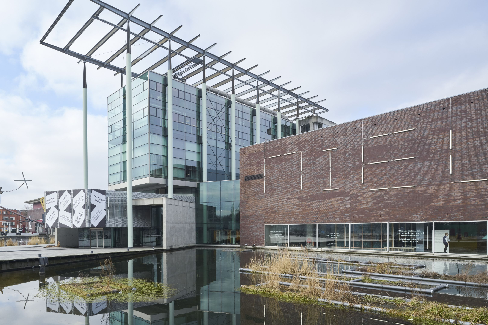

*Het Nieuwe Instituut. Photo Johannes Schwartz.*

The Het Nieuwe Instituut is a Design, Architecture, and Digital culture museum in Rotterdam, Netherlands. While there they offered digital experiences in a few different contexts. One of their exhibits was about the potential for human inhabitation of Mars. This exhibit included both augmented reality: a "see yourself on Mars" type of exhibit, as well as an interested light display projected onto glass, see below.

They also had an exhibit that used screens to portray posters from the American Tea Party political group in an exhibit about extremism.

#### Neanderthal Museum

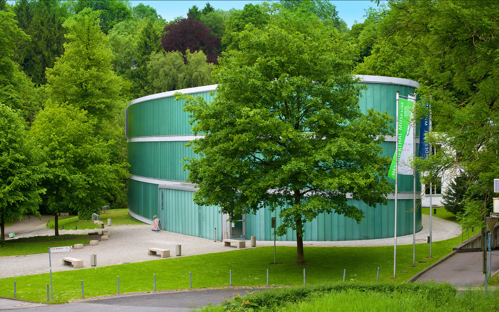

*Neanderthal Museum.  https://www.neanderthal.de/en/Museum-Building.html*

​	The Neanderthal Museum is an Archaeology museum in Mettmann, Germany. It used technology in a few different ways. One of the reasons I chose to visit the Neanderthal Museum was because of their app. Their app seems to have the basic features one would need in an app for a museum: Audioguide, Location-based information, as well as other information. However, the app does not have any options for languages other than German so most of my review will be focused on the other aspects of the museum's technological experience.

​	The museum's audioguide system is through plugging the rented headphones into audio stations in front of the exhibits.

| Pole to plug in headphones               | Audio station for app                    |
| ---------------------------------------- | ---------------------------------------- |
|  |  |

These worked fairly well, the only downside being that one has to stay stationary.

Another piece of technology they had were very large touch screen machines (also in German), and in the opposite side of the touch screen the box had cupboard with objects inside for more tactile learning options.

| Side of machine with touch screen         | Cupboards with tactile activities inside          |
| ----------------------------------------- | ------------------------------------------------- |
|  |  |

Another very creative form of technology use within the museum was an installation that was meant to simulate what it was like as a neanderthal being inside of a cave. Inside the "cave" there were displays showing cave walls and fires. 

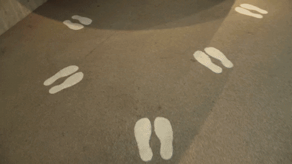

#### Städel Museum

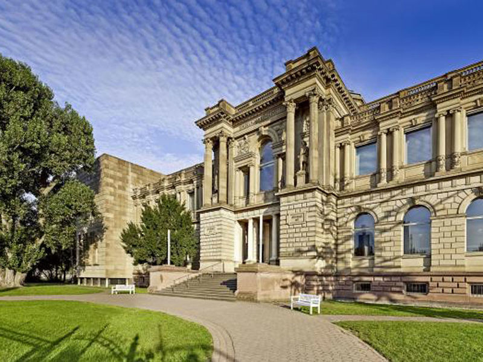

*Städel Museum Exterior. https://www.frankfurt-tourismus.de/en/Media/Attractions/Museums/Staedel-Museum*

​	The Städel Museum is an art museum in Frankfurt, Germany. On their website they state that "the aim of our diverse and mutually complementary digital activities is not merely to “reconstruct” a virtual museum in the digital realm."  The museum states in its article on digital strategy that "the digital realm offers unlimited scope, and the Städel Museum is taking advantage of this circumstance to expand its sphere of influence and communicate its contents on an entirely new scale" (Eschenfelder). The Städel has a heavy online presence that includes an online collection as well as an app. Their app is very similar to their in-museum audio guide. It also offers different options of different narratives to hear about the piece. 

| App Screenshots                                     | Descriptions                                                 |
| --------------------------------------------------- | ------------------------------------------------------------ |
| 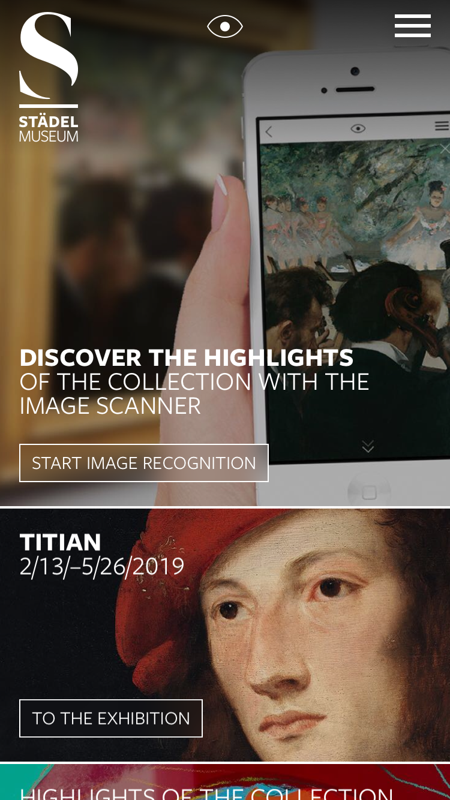 | The app's homepage                                           |
| 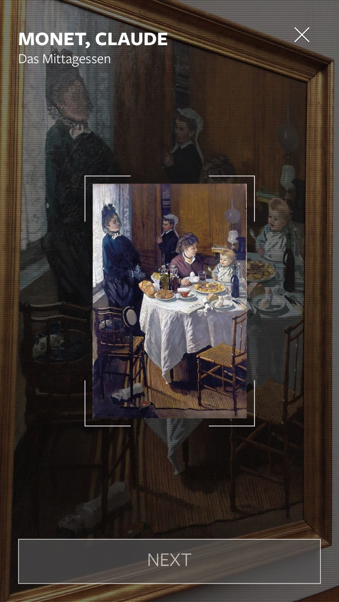                     | The app uses image recognition to figure out which painting you want to explore. |
| 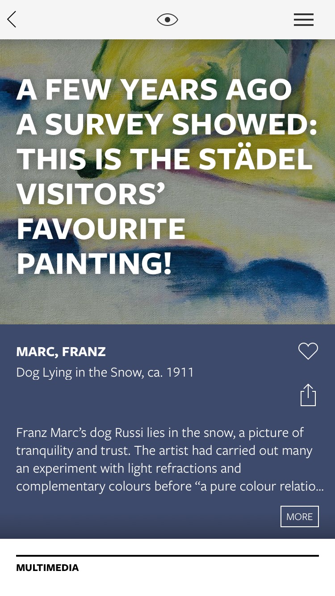               | Once you select a painting the app takes you to a page with information about the painting. |
| 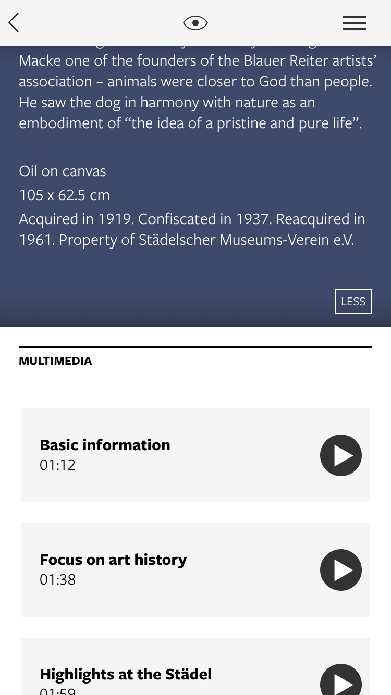             | The page continues with different categories of audioguides based on what the user wants to learn about. |
| 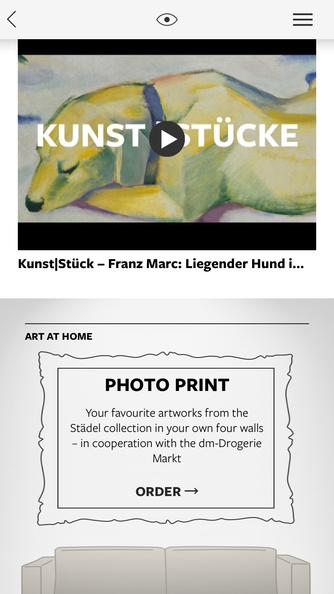             | The app also includes videos about the art pieces as well as ways to order prints of the images. |

#### Dornier Museum

The Dornier museum is an aerospace museum in Friedrichshafen, Germany. It incorporated a few artistic ways of using technology. Some of the exhibits had model planes in front of short videos playing information about the planes. 

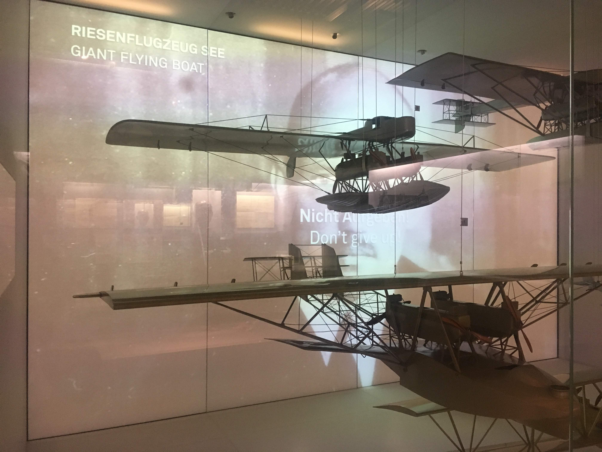

| Tech Installations                               | Descriptions                                                 |
| ------------------------------------------------ | ------------------------------------------------------------ |
| 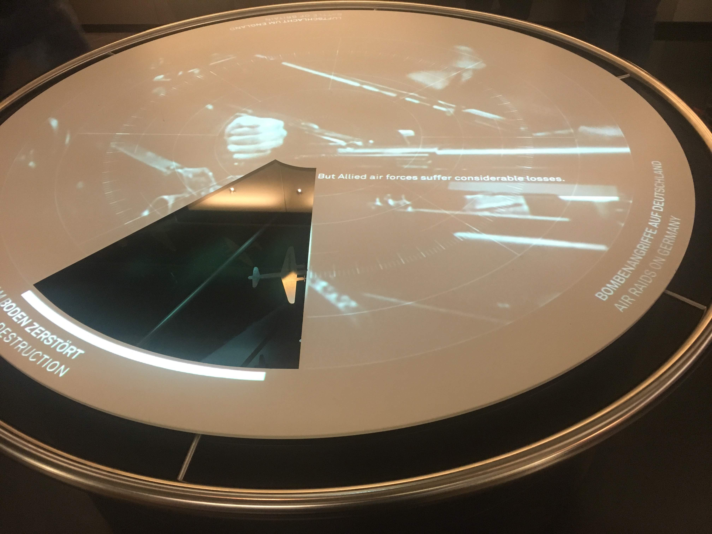 | An installation that allows you to turn the wheel to display different model planes inside. |
|      | A screen with information about the recovery of a Mission Cycle Drone. |
| 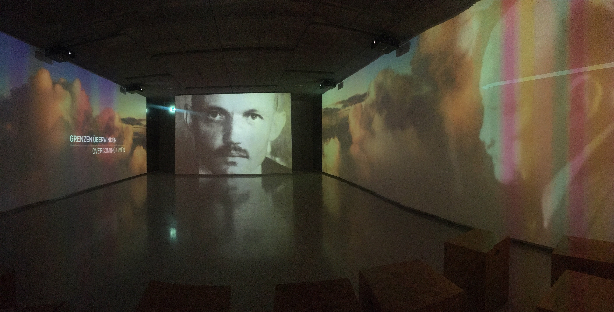         | A projector display playing a video.                         |

#### Haus der Natur

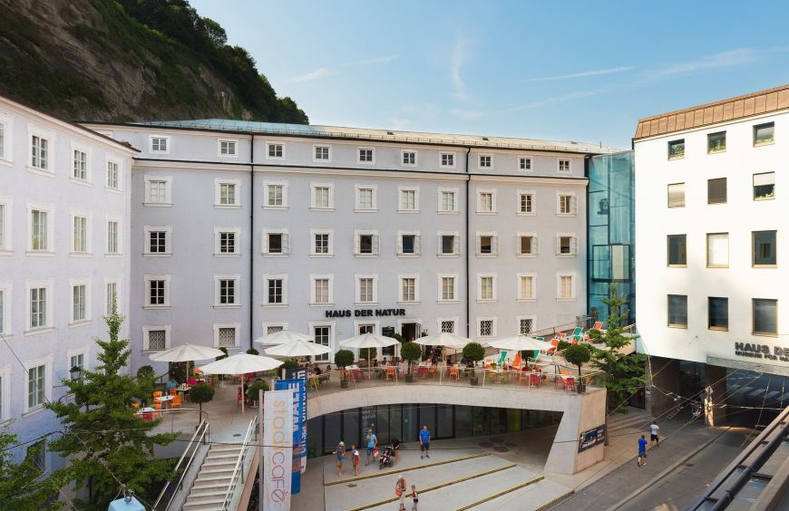

*[History - House of Nature](https://www.hausdernatur.at/en/history.html)*

​	The Haus der Natur is a science & natural history museum, which has an aquarium and a reptile zoo, in Salzburg, Austria. The most impressive part of their exhibits in terms of technology was the science museum portion which was geared towards kids and included a lot of game-like discovery or gamification.

| Installations                                | Descriptions                                                 |
| -------------------------------------------- | ------------------------------------------------------------ |
|   | A machine that teaches kids about fingerprints  by letting them scan their own and get a printout. |
|     | A simulation that allows visitors to explore through flight what the world looked like 20000 years ago as well as in present day. |
| 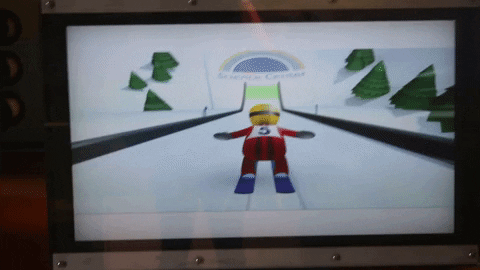 | A ski jump exhibit that allows the user to learn about  force through jumping off a platform and seeing  how well they can jump in competition with previous visitors. |

#### Keltenmuseum

*salzburg.info*	

​	The Keltenmuseum is a History museum focusing on Celtic history and art in Hallein, Austria. The Keltenmuseum unfortunately did not allow photography inside. The reason the Keltenmuseum sparked interest was because it has an app called *Sprechende Kelte* or *The Speaking Celt*. However, the museum does not provide wifi to download the app, and it is not located in a place with particularly good reception. The speaking celt is an augmented reality guide that visitors are able to point at targets in the museum and learn about what they are looking at. Philipp Breuss-Schneeweis, the creator of the app stated that “the added value for the museum visitor is that history is being told in a very personal and emotional way at the right place and time” (Philipp Breuss-Schneeweis).

| Speaking celt on target that is also outside the museum | Speaking celt on target topic about chariots |
| ------------------------------------------------------- | -------------------------------------------- |
| 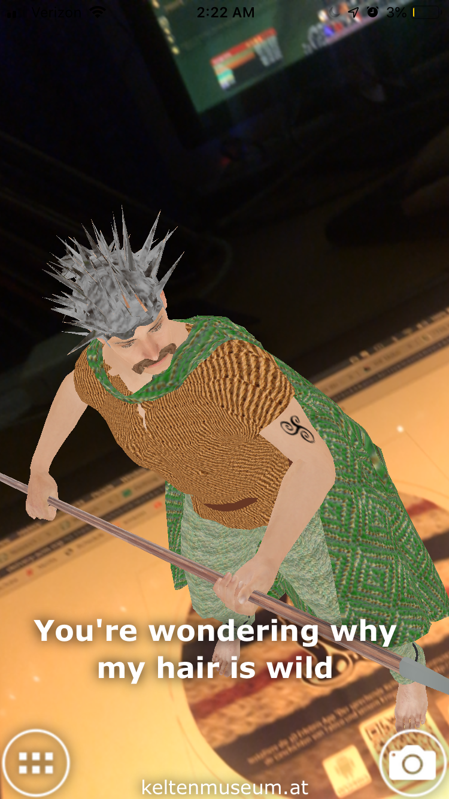                    | 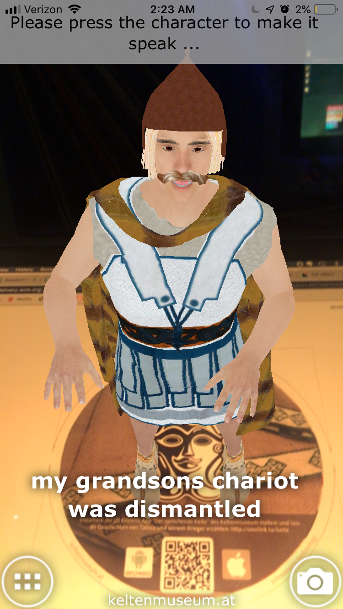           |

#### Museum für Naturkunde

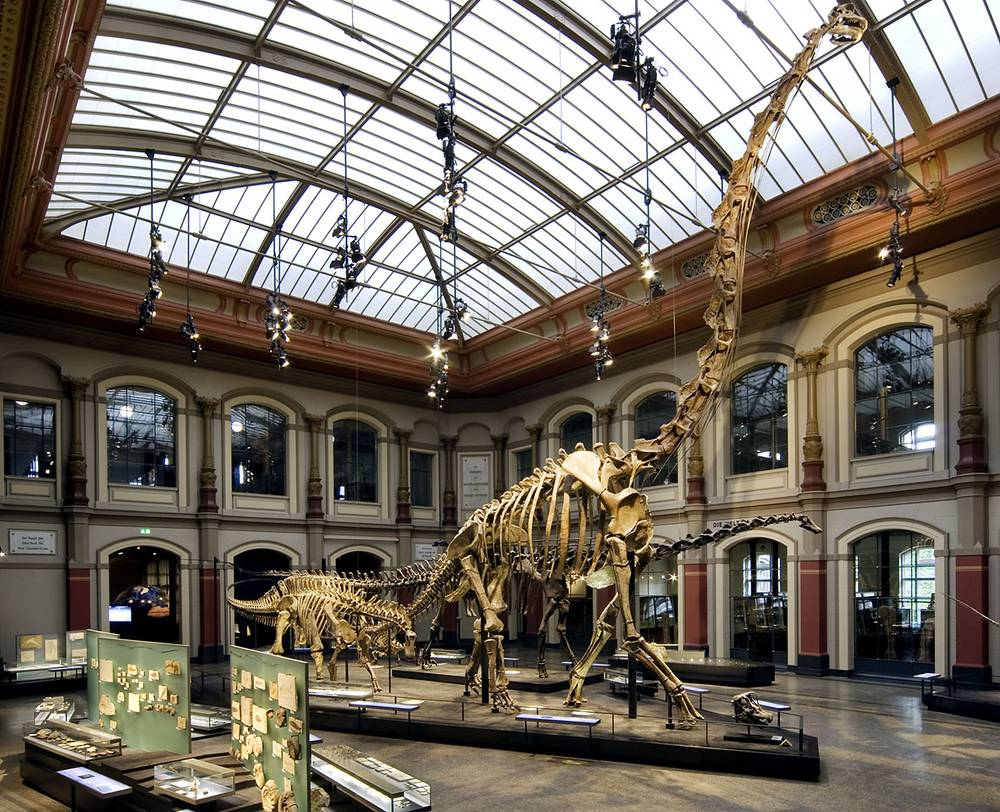

*Galerie. Museum für Naturkunde Berlin*

The Museum für Naturkunde is a Natural history museum in Berlin, Germany. The museum's use of technology was demonstrated in a few different areas of the museum. 

| Exhibit  &nbsp;&nbsp;&nbsp;&nbsp;&nbsp;&nbsp;&nbsp;&nbsp;&nbsp;&nbsp;&nbsp;&nbsp;&nbsp;&nbsp;&nbsp;&nbsp;&nbsp;&nbsp;&nbsp;&nbsp;&nbsp;&nbsp;&nbsp;&nbsp;&nbsp;&nbsp;&nbsp;&nbsp;&nbsp; | Description                                                  |
| ------------------------------------------------------------ | ------------------------------------------------------------ |
| 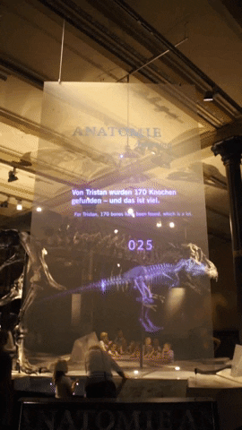                | A glass installation a slight distance from their T. Rex exhibit *Tristan*, that displays a projected animation with facts about the artifact |
| 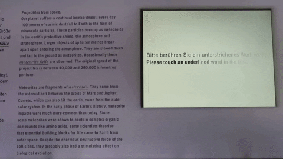                     | In some of the text displays, they had in-display monitors that would allow a visitor to tap a word in the text and start a video that defines and discusses that term. |
|          | This exhibit is a circular projection above a couch so visitors can sit back and learn about the stars and the earth. |
|                      | This installation allows a user to see the evolution of the earth starting with Pangea and moving into present day. |

#### Deep Dive: Rijksmuseum

*[Awesome Amsterdam](https://awesomeamsterdam.com/rijksmuseum/)*

​	The Rijksmuseum is an art and history museum in Amsterdam, Netherlands. The museum gets a large part of its funding (70%) from the Netherlands government (Stacey). Ingrid van Engelshoven, the Culture Minister, in 2018 announced plans to spend €80 million per year on culture with an additional  €325 million in the next few years dedicated to heritage and landmarks (Onderwijs). Engelshoven explained that "It's vital to engage as many people as possible in culture when they're young - whether making it or enjoying it" (Ondewijs). This funding avenue and philosophy may have influenced why the Rijksmuseum as well as the Van Gogh museum are heavily targeted towards children and their learning.

​	The Rijksmuseum's digital presence started due to neccessity rather than a spark of modernism. In 2003, the museum was closed for renovations and much of its collection was lent to other museums. Because of this, the curators started photographing the pieces out of neccessity. During this time though, the museum became "largely forgotten by the public" and thus they started to post their collection online. Fear exists that with a collection available for free, museum patronage would decrease. However, the opposite has been the case as "the Rijksmuseum used to get about one million visitors a year before closing and now gets more than two million a year. Making the collection available online has generated publicity and acts as a form of marketing" (Stacey).

​	In 2011 the museum expanded digitally even further when it recieved €1 million from the Dutch lottery to create a web presence (Stacey). The Rijksmuseum's app in the present day offers tours that use 300 beacons in the museum to locate where the visitors are and guide them around the museum (“The Rijksmuseum in Your Pocket - Press Releases - Press.”). This was extremely helpful to be able to find which painting one was looking for. The app also allows visitors purchase tickets or access the online collection where they can save the pieces of art they enjoy.

| App Screenshots                                              | Description                                                  |
| ------------------------------------------------------------ | ------------------------------------------------------------ |
| 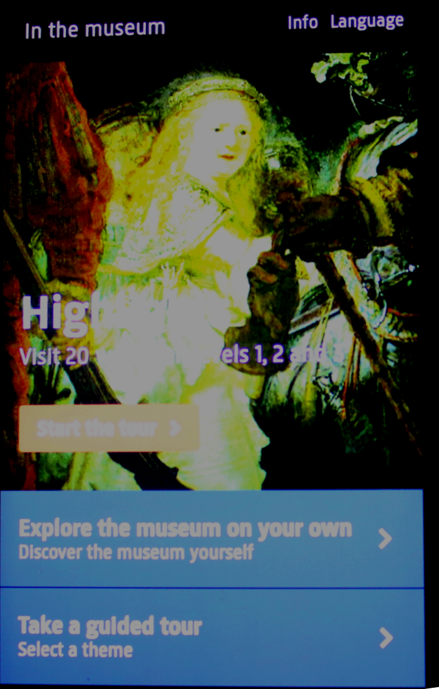              | The home page of the app/multimedia tour which allows the user to select either one of 14 guided tours or the ability to explore on their own at their own pace. It additionally allows them to select from one of 9 different languages. |
| 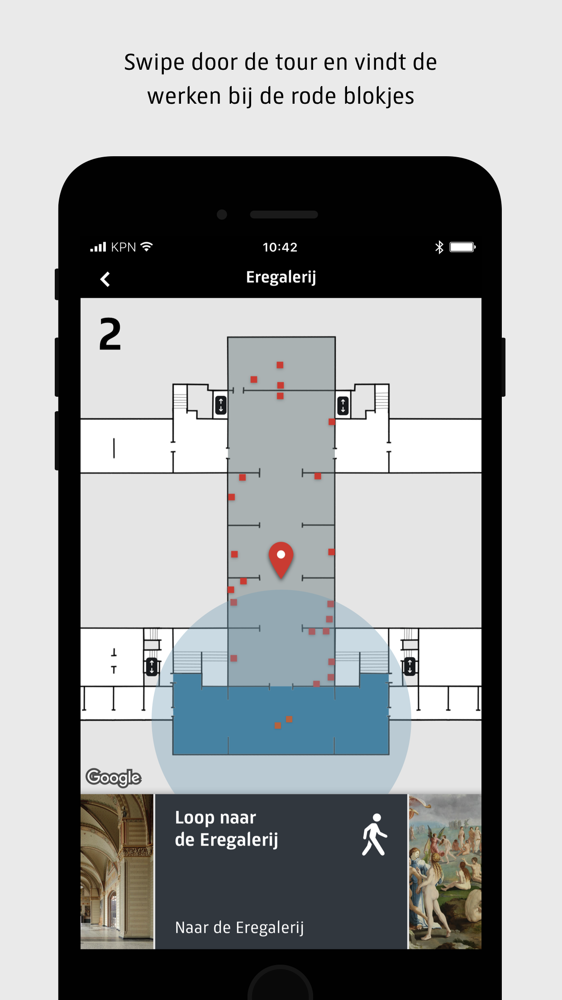 | The app allows you to see where art pieces are compared to where you are. |
| 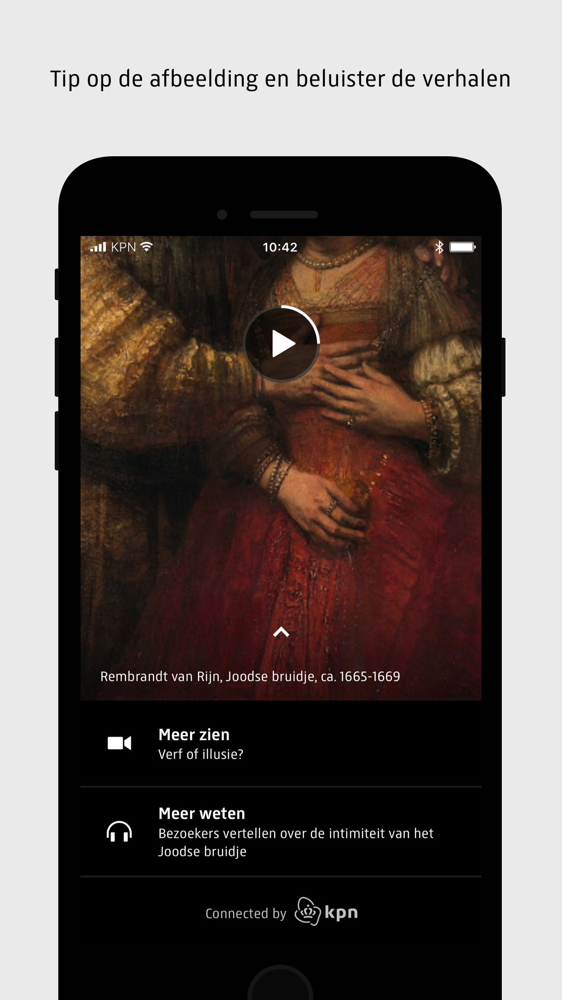 | This is what the app looks like when the user is viewing a specific piece of work. |

#### Van Gogh Museum: Deep Dive

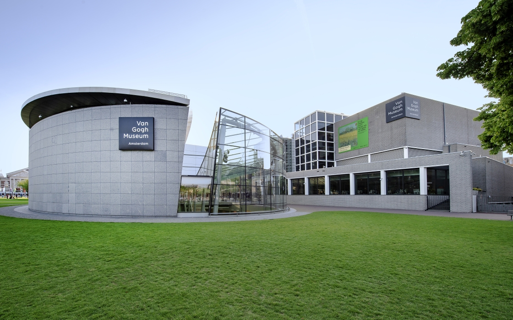

​	*Van Gogh Museum.*

​	The Van Gogh Museum is a museum in Amsterdam, Netherlands that focuses on the many works of Van Gogh. The Van Gogh museum in recent years has won awards for their app, racking up the most points in the category that deals with communication with the public before, during, and after a museum experience (“App Touch Van Gogh Wins Another Two Awards”). The museum was able to take advantage of the "new technological ‘habits’" of visitors to be able to "promote immersion and engagement among visitors and non-visitors alike, onsite and online" (“Heritage in Motion - Europeana”).

​	One of the main focuses of the app, as outlined in *Touch Van Gogh and Be Touched*, was layered presentation of information, or "starting with an action or interaction (intuitive interface, not much language) and giving context or explanation in a second layer." This is demonstrated in the area of the app that allows a user to "scratch" away on an iPad, the upper layer of a painting to reveal the painting hidden beneath.

​	Another one of the unique features of the app/multimedia guide is their ability to steer crowds away from popular paintings. The audio portion of the guide would give an introduction to the painting  and then say something to the effect of "Step back and let others have a chance to view the painting" and then continue on with information about the piece. This was an interesting approach to not only educate the visitors but to also provide a solution to a much greater problem which is crowd control next to popular pieces of art.

|                                                              |                                                              |
| ------------------------------------------------------------ | ------------------------------------------------------------ |
| 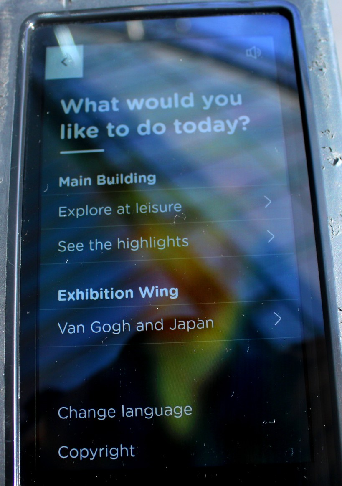            | The beginning of the app that allows the user to select which way they would like to explore the museum. |
| 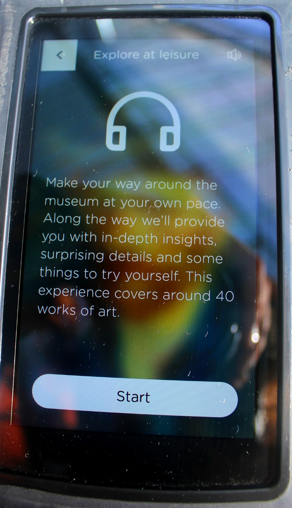                    | Detailing the "Explore at leisure" option.                   |
| 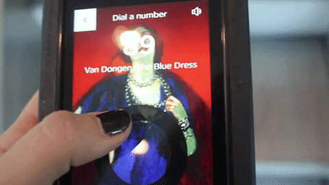          | The part of the app that allows the user to select what painting they want to learn about based on a number next to the painting. |
| 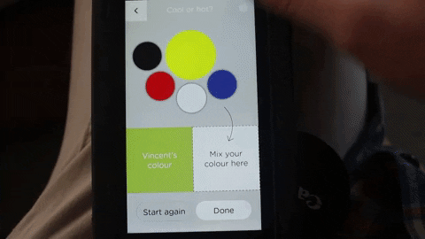        | A portion of the app that allows the user to experiment with mixing "paint" based off of the color in Van Gogh's painting. |
| 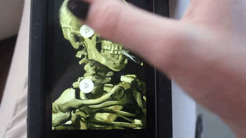 | A part of the app that allows the user to click on specific parts of the painting and hear more about them. |
| 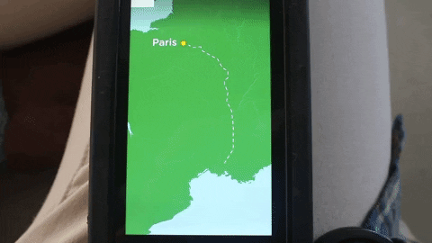                  | An animation of a part of Van Gogh's life and short videos with historical contexts behind them. |

### Best and Worst Practices

​	There were many different ways in which the information was presented technologically, and I will now, using the contexts I described earlier, explore some of the most and least effective ones and why they were or were not effective.

##### Technicality as a Wholistic Redesign

​	In a few of the museums that I observed, the technicality seemed to be plopped on top of the museum itself rather than thought of from the ground up. This goes against the principle of constructionism stated earlier that "Learners use technology to achieve specifc learning goals rather than experiencing technology as a bolt-on or after-thought" (Charles). For example, in the Keltenmuseum, they had a very educational, engaging and interesting app using augmented reality that could transform museum education. However, without wifi to download the app once the visitor is at the museum, the app won't get any use.

​	Comparatively, the Rijksmuseum installed location beacons and had multimedia guides available for rent, demonstrating that the addition of technology was not an afterthought but a more wholisitic redesign.

##### Use of a Multimedia Guide as an Audioguide with a Screen

​	Another common practice I witnessed was multimedia guides were often used just as a more technical way to have an audioguide. For example, the Neanderthal App was a collection of their already recorded audioguides. This is understandable, but does not fully utilize the benefit that a touch screen provides. In fact, only one of the media guides made full use of the interactive technology and that was the Van Gogh museum. A few of the museums contained both audio clips and video clips as part of the experience, but with a tool as interactive as a touchscreen, it's a shame to not take full advantage of the audio/visual as well as tactile features. A reasoning against implementing anything other than audio could be that it takes one's attention away from the content/exhibit. However, the view of the exhibit will be even more fully appreciated when one is able to interact and learn more constructively. One of the previously mentioned tenants of constructionism is for learners to be able to apply their knowledge. Interaction with a touch screen is a great facilitator for this application of knowledge when it is utilized effectively.

##### Accessibility for a Wider Audience

​	While many of the technical pieces were meant for broader audiences, a few were only in one language. This can be understandable for a smaller museum without as many resources. However, it is so important that at least the technical pieces in a museum can be accessed by all, because often there won't be in-person guides that know enough languages to cater to everyone's museum experience. Without a device in one's own language, the technology and information is uncomprehensible and useless. 

##### Discoverability

​	Another emphasis of constructionism is the ability to explore and discover by oneself. Many of the museums were very strong in this aspect. It was evident that they considered their audience would want to be flexible in the paths they take. For example both the Rijksmuseum and the Van Gogh museum offered options for which tour/path to take on their audioguide. The Van Gogh museum pushed it even further because in the content itself, it allowed users to figure out which pieces of information they wanted to learn more about. The Städel museum also had an option in the different multimedia options for a "focus on art history," or "Basic information." This feature allows the user to explore and learn what they want to learn about the piece. The only problem with the Städel's implementation of this feature is that the different sections repeat much of the same information.

##### Creation & Gamification

​	In line with constructionism, the ability to "make" or "experiment" with what one is learning is essential. The Van Gogh museum app allowed users to "mix their own paint" colors to match that of Van Gogh's. The Haus der Natur allowed learners to sing into a microphone to learn about their vocal chords, to create a printout of their fingerprints to understand that technology and to learn about the doppler effect by throwing a ball as hard as they could against a wall. It fostered tactile learning and allowed learners to experiment with what worked and what did not. 

##### Connections and Contexts

​	One of the most beneficial parts of the museums was their ablility to connect new and old knowledge. This is a facet of constructionism, the ability to construct understandings and mental models of new information based on old information. In the Städel museum, one of their exhibits was was called "Rubens. The Power of Transformation" and as the Städel describes it: "the presentation revealed how profound the dialogue was into which Rubens entered with his predecessors’ and contemporaries’ achievements and fathomed the scope of their impact on the five decades of his production" (“Rubens”). This exhibit borrowed many pieces of work from other museums; they borrowed the works to add context for Rubens' work. This is important in learning about subjects that one has little experience in. Part of what made this so powerful was because the viewer was able to experience the works that Rubens was inspired by. This is one of the reasons why multimediaguides should be used to their full potential. The museum does not need to get other works from different museums if they viewers can be shown what the work is contextualized by. This is such an important revelation because artifacts do not exist in a vacuum, they exist as a small part of the world around them.

##### Desirability & Aesthetics

​	Lastly, one of the elements of user experience that is not neccessarily essential to education, but, is essential to engagement is the aesthetic design of the technology. The museums had a wide range of designs, ranging from beautiful but useless to useful but designed poorly. In general though, if the museum put the thought into the design, they also put thought into the educational value but that was not always the case.

### Conclusion

​	There are many museums in the modern era that are trying to modernize to engage and bring in patrons. Some implementations find the perfect intersection between user experience and educational value, yet others miss the mark by either having beautiful technology without purpose or having great content without an equally great platform to support it. 

​	This venture into technology is done in many different ways from very old school methods like plugging headphones into an audio station to very new methods like having an augmented reality guide to a museum. The technology is at a state of progress that allows museums to experiment with new methods of teaching and new ways of designing exhibits from the ground up. The technology should be conceptualized from the inception of exhibits rather than tacked on after completion. As the Van Gogh Museum ellaborates: "hands-on displays should be considered from the start of exhibition conception and planning"("Touch Van Gogh and Be Touched – How New Media Are Transforming the Way We Present Complex Research"). 

Technology changes the way in which we interact with the world and it provides fountains of information in the form of tools which we may fully utilize to have the greatest effect. This is the direction we should be moving in, and when museums add these features, they should ask themselves whether what they are creating is beneficial in both user experience and educational value and not just in hype.

_____

### Resources & Further Reading

Alvermann, Jens. “Proceedings of the 2016 ACM International Joint Conference on Pervasive and Ubiquitous Computing.” *Proceedings of the 2016 ACM International Joint Conference on Pervasive and Ubiquitous Computing*, 2016, [www.academia.edu/28494410/Alvermann_Jens_2016_Mobile_Media_in_the_Museum_Space_the_Example_of_the_Neanderthal_Museums_App_Neanderthal_](http://www.academia.edu/28494410/Alvermann_Jens_2016_Mobile_Media_in_the_Museum_Space_the_Example_of_the_Neanderthal_Museums_App_Neanderthal_).

 “App Touch Van Gogh Wins Another Two Awards.” *Van Gogh Museum*, 12 Nov. 2014, [www.vangoghmuseum.nl/en/news-and-press/news/app-touch-van-gogh-wins-another-two-awards?v=1](http://www.vangoghmuseum.nl/en/news-and-press/news/app-touch-van-gogh-wins-another-two-awards?v=1).

 Brandt, Ron. “On Teaching for Understanding: A Conversation with Howard Gardner.” *On Teaching for Understanding: A Conversation with Howard Gardner*, ASCD, Apr. 1993, www.ascd.org/publications/educational-leadership/apr93/vol50/num07/On-Teaching-for-Understanding@-A-Conversation-with-Howard-Gardner.aspx.

Caroline Pantofaru, Austin Hendrix, Andreas Paepcke, Dirk Thomas, Sharon Marzouk, and Sarah Elliott. 2013. Programming robots at the museum. In Proceedings of the 12th International Conference on Interaction Design and Children (IDC '13). ACM, New York, NY, USA, 305-308. DOI=10.1145/2485760.2485797 http://doi.acm.org/10.1145/2485760.2485797

Charles, Lorraine. *Education, Knowledge and Learning*. Pi-Top, 2018, [cdn2.hubspot.net/hubfs/4368942/Reports%20and%20whitepapers/Research%20Education%20Knowledge%20Learning%20%2011012019.pdf](http://cdn2.hubspot.net/hubfs/4368942/Reports and whitepapers/Research Education Knowledge Learning  11012019.pdf).

David L, "Montessori Method (Montessori)," in *Learning Theories*, February 1, 2016, https://www.learning-theories.com/montessori-method-montessori.html.

Enasel, Iulia-Oana. “The Role of Information in Art Museum Communication Process .” Science Direct, Elsevier B.V., 2013, ac.els-cdn.com/S2212567113001652/1-s2.0-S2212567113001652-main.pdf?_tid=670fd846-1075-11e8-a7ff-00000aab0f6b&acdnat=1518495886_03f0302f6f12bcbc497ef1138f024f51.

Eschenfelder, Chantal. “The Städel Museum's Digital Strategy.” *Städel Museum*, [www.staedelmuseum.de/en/stadel-museums-digital-strategy](http://www.staedelmuseum.de/en/stadel-museums-digital-strategy).

Fogarty, Lori. “The Public Historian.” *The Public Historian*, vol. 33, no. 2, 2011, pp. 127–129. *JSTOR*, JSTOR, www.jstor.org/stable/10.1525/tph.2011.33.2.127.

Hassenzahl, Marc. “User Experience and Experience Design.” *The Interaction Design Foundation*, [www.interaction-design.org/literature/book/the-encyclopedia-of-human-computer-interaction-2nd-ed/user-experience-and-experience-design](http://www.interaction-design.org/literature/book/the-encyclopedia-of-human-computer-interaction-2nd-ed/user-experience-and-experience-design).

“Heritage in Motion - Europeana.” *Heritage in Motion - Europeana | Touch Van Gogh - App for Tablet*, 2014, [heritageinmotion.eu/himentry/touch-van-gogh-app-for-tablet](http://heritageinmotion.eu/himentry/touch-van-gogh-app-for-tablet).

Jacob B. Madsen and Claus B. Madsen. 2015. Handheld Visual Representation of a Castle Chapel Ruin. J. Comput. Cult. Herit. 9, 1, Article 6 (November 2015), 18 pages. DOI=http://dx.doi.org/10.1145/2822899

Kay, Alan. “A Powerful Idea about Ideas.” *TED: Ideas Worth Spreading*, TED, 2007, www.ted.com/talks/alan_kay_shares_a_powerful_idea_about_ideas.

MIT News Office. “Professor Emeritus Seymour Papert, Pioneer of Constructionist Learning, Dies at 88.” *MIT News*, MIT Media Lab, 1 Aug. 2016, news.mit.edu/2016/seymour-papert-pioneer-of-constructionist-learning-dies-0801.

Morville, Peter. “User Experience Design.” *Semantic Studios*, 11 Oct. 2016, [semanticstudios.com/user_experience_design/](http://semanticstudios.com/user_experience_design/).

“MW2015.” *Museums and the Web 2015*, 2015, [mw2015.museumsandtheweb.com/bow/van-gogh-museum-multimedia-guide-re-designing-the-visitor-experience/](http://mw2015.museumsandtheweb.com/bow/van-gogh-museum-multimedia-guide-re-designing-the-visitor-experience/).

Onderwijs, Ministerie van, and Wetenschap. “Government Shows Commitment to Culture with Major Funding Drive.” *News Item |* [Government.nl](http://Government.nl), Ministerie Van Algemene Zaken, 15 Mar. 2018, [www.government.nl/latest/news/2018/03/12/government-shows-commitment-to-culture-with-major-funding-drive](http://www.government.nl/latest/news/2018/03/12/government-shows-commitment-to-culture-with-major-funding-drive).

Philipp Breuss-Schneeweis. 2016. "The speaking celt": augmented reality avatars guide through a museum -- case study. In Proceedings of the 2016 ACM International Joint Conference on Pervasive and Ubiquitous Computing: Adjunct (UbiComp '16). ACM, New York, NY, USA, 1484-1491. DOI: https://doi.org/10.1145/2968219.2974044

“Rubens.” *Städel Museum*, 2018, [www.staedelmuseum.de/en/rubens](http://www.staedelmuseum.de/en/rubens).

Sherman, Aliza. “How Tech Is Changing the Museum Experience.” *Mashable*, Mashable, 14 Sept. 2011, mashable.com/2011/09/14/high-tech-museums/#8SXn6w7o3kqP.

Smith, Mark K. “Jerome Bruner and the Process of Education.” *Infed.org*, YMCA George Williams College, 2002, infed.org/mobi/jerome-bruner-and-the-process-of-education/.

Stacey, Paul. “Rijksmuseum.” *Medium*, Made with Creative Commons, 25 Sept. 2017, [medium.com/made-with-creative-commons/rijksmuseum-2f8660f9c8dd](http://medium.com/made-with-creative-commons/rijksmuseum-2f8660f9c8dd).

*Strategic Plan*. Museum of Applied Arts & Sciences, 2017, maas.museum/app/uploads/2017/02/strategic-plan-2017-2022.pdf.

“The Rijksmuseum in Your Pocket - Press Releases - Press.” *Rijksmuseum*, Rijksmuseum, [www.rijksmuseum.nl/en/press/press-releases/the-rijksmuseum-in-your-pocket](http://www.rijksmuseum.nl/en/press/press-releases/the-rijksmuseum-in-your-pocket).

"Touch Van Gogh and Be Touched – How New Media Are Transforming the Way We Present Complex Research." *MW2014: Museums and the Web 2014*. Published January 31, 2014. Consulted May 6, 2019.

Vermeeren, Arnold P.O.S., and Raffeaella Trocchianesi. *Involving the Crowd in Future Museum Experience Design*. Association for Computing Machinery, 2016, delivery.acm.org/10.1145/2860000/2856482/ea3347-vermeeren.pdf?ip=157.242.200.139&id=2856482&acc=ACTIVE%20SERVICE&key=80B0E63637265656%2E958C566062FD1C18%2E4D4702B0C3E38B35%2E4D4702B0C3E38B35&__acm__=1517389338_4337fc5fbd96eb1e3c6baf80feffadf5.

Victor, Bret. “Bret Victor - Inventing on Principle.” *Vimeo*, 9 May 2019, vimeo.com/36579366.

Victor, Bret. “Learnable Programming.” *Learnable Programming*, Sept. 2012, worrydream.com/LearnableProgramming/.

*Web and New Media Strategy*. Smithsonian Institution, 30 July 2009, www.si.edu/content/pdf/about/web-new-media-strategy_v1.0.pdf.

What Are Design Principles?” *The Interaction Design Foundation*, [www.interaction-design.org/literature/topics/design-principles](http://www.interaction-design.org/literature/topics/design-principles).